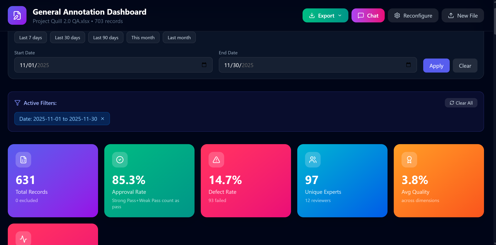

# QA Dashboard Generator

An AI-powered analytics platform that transforms quality assurance data into actionable insights with beautiful visualizations and comprehensive metrics.



## Features

### Data Import
- **Multi-file support** - Upload multiple CSV or Excel files
- **Intelligent data joining** - Connect files by common fields (e.g., Expert ID)
- **Auto-detection** - Automatically detects columns and suggests configurations
- **Multi-sheet support** - Select specific sheets from Excel workbooks

### Analytics & Metrics
- **Approval & Defect Rates** - Track pass/fail metrics across your team
- **Expert Performance** - Individual performance breakdowns with quality scores
- **Reviewer Statistics** - Monitor reviewer consistency and patterns
- **Category Analysis** - Breakdown by error type or category
- **Trend Analysis** - Visualize quality over time
- **Consensus Metrics** - Calculate agreement rates across multiple reviewers per task

### Interactive Features
- **AI Chat Assistant** - Describe the custom metrics or analytics you need, and the AI will build them into your dashboard using your existing data. Perfect for project-specific calculations, custom groupings, or metrics not covered by the setup wizard.
- **Drill-down Filtering** - Click any metric, chart, or table row to filter data
- **Date Range Filtering** - Quick presets (Last 7/30/90 days) or custom ranges
- **Real-time Updates** - All charts and metrics update instantly when filters change
- **Search & Sort** - Find specific experts, categories, or reviewers quickly

### Export Options
- **CSV Export** - Download filtered data for further analysis
- **JSON Export** - Full data export with all metrics
- **Print-ready** - Clean layouts optimized for printing/PDF

### Project Types
Pre-configured templates for common QA workflows:
- Video Generation (T2V, V2V, PV2V)
- Photography & Image Annotation
- Medical/Healthcare
- Coding/Programming
- Legal Document Review
- Language/Translation
- General Annotation

## Tech Stack

- **React 18** - UI framework
- **Recharts** - Data visualization
- **Tailwind CSS** - Styling
- **Lucide React** - Icons
- **PapaParse** - CSV parsing
- **SheetJS (xlsx)** - Excel file parsing

## Installation
```bash
# Clone the repository
git clone https://github.com/yourusername/qa-dashboard-generator.git

# Navigate to project directory
cd qa-dashboard-generator

# Install dependencies
npm install

# Start development server
npm start
```

The app will open at [http://localhost:3000](http://localhost:3000)

## Usage

### Quick Start

1. **Upload Data** - Drag and drop your CSV or Excel file(s)
2. **Select Sheets** - Choose which sheets to analyze (for Excel files)
3. **Configure Mapping** - Map your columns to the required fields:
   - Expert/Worker ID (required)
   - Score/Status column (required)
   - Timestamp, Category, Reviewer (optional)
4. **Set Thresholds** - Define what constitutes Pass, Weak Pass, and Fail
5. **Generate Dashboard** - View your interactive analytics dashboard

### Score Formats Supported

| Format | Example Values |
|--------|---------------|
| Numeric (1-5) | 1, 2, 3, 4, 5 |
| Percentage | 0.76, 85%, 92 |
| Text Labels | Good, Bad, Strong Pass, Weak Pass, Fail |
| Binary | Yes/No, True/False, 1/0, Pass/Fail |

### Consensus Analysis

For projects with multiple reviewers per task:
1. Enable "Consensus" in Step 2
2. Select your Task ID column
3. Choose which columns to calculate consensus on
4. View disagreement rates and expert accuracy scores

## Dashboard Sections

### KPI Cards
- Total Records
- Approval Rate
- Defect Rate
- Unique Experts
- Average Quality Score

### Charts
- Status Distribution (Donut/Pie)
- Daily Trend Analysis (Area/Line)
- Category Distribution (Horizontal Bar)
- Quality Trend Over Time

### Tables
- Expert Performance - Individual metrics per expert
- Category Breakdown - Metrics by error type/category
- Reviewer Statistics - Reviewer patterns and consistency

## Customization

### Chart Preferences
- Status chart: Donut, Pie, or Bar
- Trend chart: Bar, Area or Line
- Color schemes: Purple, Blue, Green, Orange

### Table Visibility
Toggle visibility for:
- Expert Performance table
- Category Breakdown table
- Reviewer Statistics table
- Detailed Records table

## Project Structure
```
qa-dashboard-generator/
├── public/
│   ├── index.html
│   ├── favicon.ico
│   └── manifest.json
├── src/
│   ├── App.js              # Main application component
│   ├── index.js            # Entry point
│   └── index.css           # Tailwind imports
├── package.json
├── tailwind.config.js
└── README.md
```

## Configuration

### Environment Variables

No environment variables required for basic usage.

### Tailwind Configuration

The project uses a custom Tailwind configuration optimized for dark mode dashboards. Key colors:
- Background: `slate-950` (#020617)
- Cards: `slate-900` with backdrop blur
- Accent: `indigo-500` to `purple-600` gradients

## Browser Support

- Chrome (recommended)
- Firefox
- Safari
- Edge

## Contributing

Contributions are welcome! Please feel free to submit a Pull Request.

1. Fork the repository
2. Create your feature branch (`git checkout -b feature/AmazingFeature`)
3. Commit your changes (`git commit -m 'Add some AmazingFeature'`)
4. Push to the branch (`git push origin feature/AmazingFeature`)
5. Open a Pull Request

## License

This project is licensed under the MIT License - see the [LICENSE](LICENSE) file for details.

## Author

**Tammy Hartline**
- Website: [tammyhartline.tech](https://tammyhartline.tech)
- GitHub: [@tammyhartline](https://github.com/thartline35)

---

<p align="center">
  Conceptualized, Designed, Engineered, and Deployed by<br>
  <strong>AI Engineer, Tammy Hartline</strong><br>
  © 2025 All Rights Reserved
</p>